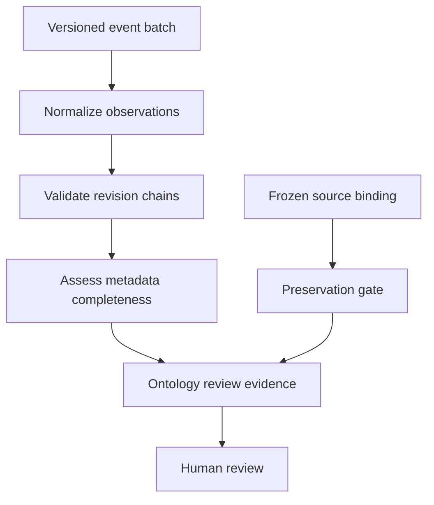

# Phase IV: Agentic Graph Engineering

Status: adopted for the Phase-IV engineering cycle, 2026-09-07.

The user accepted the Stage-0 direction and requested that all subsequent progress be recorded in this repository using the existing project delivery discipline. The original v0.1 research contract is retained byte for byte. It remains an incomplete experimental preregistration until its declared bindings are resolved.

## Inherited method

This research adaptation follows the project's [delivery graph](https://github.com/tech-com-UA00001/theresistance/blob/c24e7ca97ce6f5a2bf593c0ca67e7f50c43b00cb/docs/engineering/agentic-delivery.md), [Agentic Graph Engineering](https://github.com/tech-com-UA00001/theresistance/blob/c24e7ca97ce6f5a2bf593c0ca67e7f50c43b00cb/docs/agentic-graph-engineering.md), and [backend ADR-001](https://github.com/tech-com-UA00001/theresistance-back/blob/7a8107e4451891535366acaf766348785ccc157b/docs/architecture/ADR-001-progressive-backend-modernization.md):

- Each increment changes the smallest useful part of the dependency graph.
- Inputs, outputs, invariants, failure states, and permitted side effects are explicit.
- Domain state is typed, immutable, versioned, and serializable.
- Nodes are deterministic, independently testable, and fail before producing an accepted output.
- External I/O stays at a boundary. Research outcomes cannot flow back into a frozen decision or registration.
- Tests, regression checks, and human judgment control promotion. Engineering success is distinct from scientific readiness.

The frontend-specific static-export and publication checks are not imported as research requirements. Their boundary-preservation principle is implemented here as preservation of the complete inherited source tree and prohibition of fitting/outcome access in the ontology graph.

## Branches and delivery

The research repository currently has its scientific implementation on `research/phase3-minmax-contract`; `main` contains the initial project base. Therefore:

- `research/phase3-minmax-contract` stays at the inspected scientific source snapshot.
- `research/phase4-temporal-state` is the Phase-IV integration branch, initially based on that snapshot.
- `feature/phase4-*` contains one bounded increment and its evidence, reviewed by PR into the Phase-IV branch.
- `main` receives no direct development changes. A later publication/release proposal is separate.

The cycle is scope and contract → implementation → scoped lint/type checks → deterministic tests → inherited regression tests → package build → PR checks and human review → integration. A green PR does not authorize training, outcome access, scientific promotion, or a merge without the human gate.

## Current graph cut

This graph establishes schema and provenance vocabulary only. No historical sequence selection, database connector, embedding, prediction, robust decision, label construction, or statistical evaluation is implemented in this cut.

Every PR must report its scope, source commit, checks, preservation result, scientific gates still blocked, and next permitted operation. Append evidence after checks; preserve the original preregistration commit in the history.
